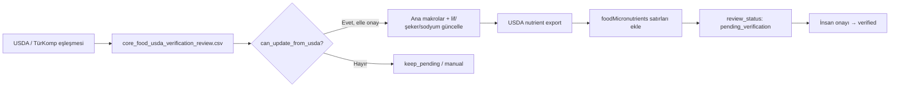

# Mikrobesin (Vitamin / Mineral) Şema Planı

Bu belge, Kalorimetre kataloğunda lif/şeker/sodyum sonrası isteğe bağlı vitamin ve mineraller için önerilen veri yapısını tanımlar. **Bu aşamada `foodDatabase.js` değiştirilmez** — yalnızca planlama amaçlıdır.

## Tasarım İlkeleri

1. **Ana tabloda zorunlu alanlar:** `calories`, `protein`, `carbs`, `fat`, `fiber`, `sugar`, `sodium` — günlük özet ve liste görünümü için yeterli.
2. **Vitamin/mineraller ayrı, esnek tabloda:** Her gıda için tüm mikrobesinler dolu olmayabilir; eksik değer = kaynak yok veya henüz doğrulanmadı.
3. **Kaynak zorunluluğu:** Her mikrobesin satırında `source` ve `source_food_id` olmalı. AI tahmini veya uydurma değer kabul edilmez.
4. **Görünürlük:** Mikrobesinler yalnızca **detaylı besin görünümünde** (ör. gıda kartı genişletilmiş panel, besin profili sayfası) gösterilir; ana arama listesinde veya günlük özet şeridinde gösterilmez.

## Önerilen Yapı: `foodMicronutrients`

Ayrı bir dizi veya (ileride) Supabase tablosu olarak tutulabilir:

```js
export const FOOD_MICRONUTRIENTS = [
  {
    food_id: 45,
    nutrient_code: 'vitamin_c_mg',
    nutrient_name_tr: 'C Vitamini',
    nutrient_name_en: 'Vitamin C',
    amount_per_100g: 4.6,
    unit: 'mg',
    source: 'USDA',
    source_food_id: '171688',
    review_status: 'pending_verification',
  },
]
```

### Alan Tanımları

| Alan | Tip | Açıklama |
|------|-----|----------|
| `food_id` | number | `MASTER_FOOD_DB` / katalog `id` ile eşleşir |
| `nutrient_code` | string | Makine-okunur kod (snake_case) |
| `nutrient_name_tr` | string | Türkçe etiket (UI) |
| `nutrient_name_en` | string | İngilizce etiket (kaynak/debug) |
| `amount_per_100g` | number | 100 g başına miktar |
| `unit` | string | `mg`, `mcg`, `g`, `IU` vb. |
| `source` | string | `USDA`, `TURKOMP`, `OPEN_FOOD_FACTS`, `RECIPE_CALC` |
| `source_food_id` | string \| null | Kaynak sistemindeki gıda/nutrient kimliği |
| `review_status` | string | `pending_verification`, `verified`, `rejected` |

## Ana Tablo vs Mikrobesin Ayrımı

| Besin | Konum | Gerekçe |
|-------|-------|---------|
| `fiber_100g` | Ana gıda tablosu | Makro özet ve günlük lif takibi için sık kullanılır |
| `sugar_100g` | Ana gıda tablosu | Diyabet / düşük GI filtreleri için gerekli |
| `sodium_mg_100g` | Ana gıda tablosu | Hipertansiyon profili için gerekli |
| Vitaminler / mineraller | `foodMicronutrients` | İsteğe bağlı; tüm gıdalarda dolu olmayacak |

## Önerilen İlk Nutrient Kodları

| nutrient_code | nutrient_name_tr | nutrient_name_en | unit | Öncelik |
|---------------|------------------|------------------|------|---------|
| `vitamin_c_mg` | C Vitamini | Vitamin C | mg | Yüksek — meyve/sebze |
| `vitamin_a_rae_mcg` | A Vitamini (RAE) | Vitamin A (RAE) | mcg | Orta |
| `vitamin_d_mcg` | D Vitamini | Vitamin D | mcg | Orta — süt/yumurta/balık |
| `vitamin_b12_mcg` | B12 Vitamini | Vitamin B12 | mcg | Orta — et/süt/balık |
| `calcium_mg` | Kalsiyum | Calcium | mg | Yüksek — süt ürünleri |
| `iron_mg` | Demir | Iron | mg | Yüksek — baklagil/et |
| `potassium_mg` | Potasyum | Potassium | mg | Orta |
| `magnesium_mg` | Magnezyum | Magnesium | mg | Düşük |
| `zinc_mg` | Çinko | Zinc | mg | Düşük |

## UI Gösterim Kuralları

- **Ana liste / arama sonuçları:** Yalnızca kalori + P/K/Y (+ varsa lif özeti etiketi).
- **Sepet / porsiyon önizleme:** Makrolar + lif/şeker/sodyum (doğrulanmışsa).
- **Detaylı besin paneli ("Besin Profili"):** Yukarıdakilere ek olarak, `foodMicronutrients` içinde `review_status === 'verified'` olan vitamin/mineraller gruplu listelenir:
  - *Vitaminler*
  - *Mineraller*
- Eksik mikrobesinler için "Veri yok" veya alan gizlenir — sıfır placeholder gösterilmez.

## Doğrulama Akışı



## İleride Supabase Uyumu

Mevcut `nutrition_foods` RPC'si makro + lif/şeker döndürüyorsa, vitamin/mineral için:

- Ya genişletilmiş RPC (`get_food_nutrients(food_id)`)
- Ya da ayrı `nutrition_micronutrients` tablosu (`food_id`, `nutrient_code`, `amount`, `unit`, `source`)

Her iki durumda da `foodMicronutrients` yerel yapısı, offline `foodDatabase.js` ile aynı şemayı korur.

## Bu Aşamada Yapılmayanlar

- `foodDatabase.js` içine vitamin alanları eklenmez
- Otomatik mikrobesin doldurma yapılmaz
- UI'da detay paneli henüz bağlanmaz

Önce `core_food_usda_verification_review.csv` üzerinden temel makrolar + lif/şeker/sodyum doğrulanacak; ardından aynı USDA `source_food_id` ile mikrobesin export adımı planlanacak.
